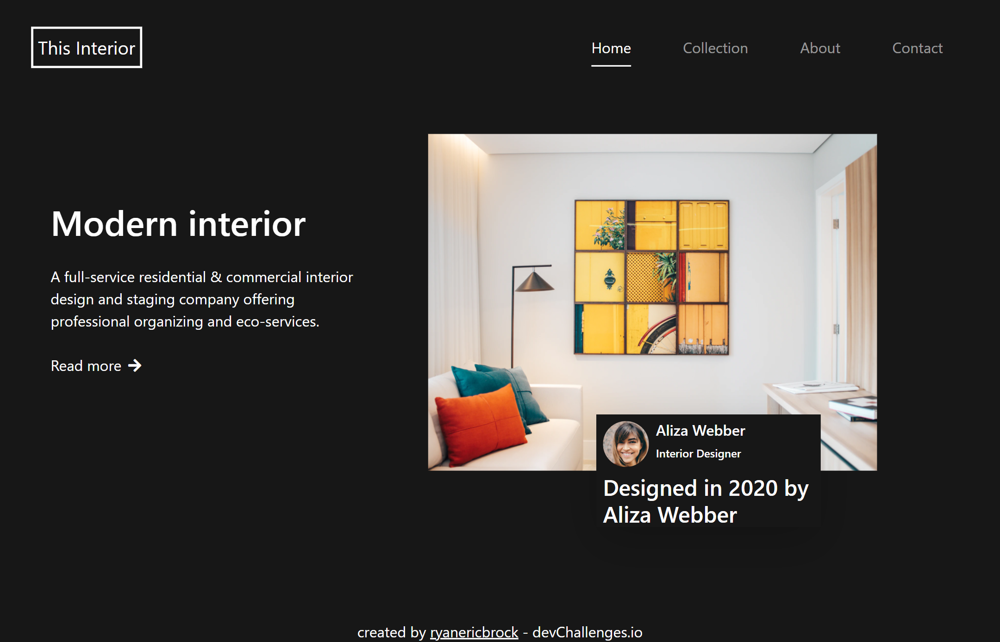

<!-- Please update value in the {}  -->

<h1 align="center">Interior Consultant Challenge</h1>

   Solution for a challenge from  <a href="http://devchallenges.io" target="_blank">Devchallenges.io</a>.

  <h3>
    <a href="https://ryanericbrock.github.io/Interior-Consultant-Challenge/">
      Demo
    </a>
     | 
    <a href="https://github.com/ryanericbrock/Interior-Consultant-Challenge">
      Solution
    </a>
     | 
    <a href="https://devchallenges.io/challenges/Jymh2b2FyebRTUljkNcb">
      Challenge
    </a>
  </h3>

<!-- TABLE OF CONTENTS -->

## Table of Contents

- [Overview](#overview)
- [Built With](#built-with)
- [Features](#features)
- [Contact](#contact)
- [Acknowledgements](#acknowledgements)

<!-- OVERVIEW -->

## Overview

- My demo is viewable at <a href="https://ryanericbrock.github.io/Interior-Consultant-Challenge/">Demo</a>
- This was a little bit of a challenge, especially with getting the image with a div over
- I have strengthened my knowledge of taking advantage of padding and margin
- Sometimes, it can be useful to use an image as a background instead of an image tag

### Built With

<!-- This section should list any major frameworks that you built your project using. Here are a few examples.-->

- [Bootstrap 5](https://getbootstrap.com/docs/5.0/getting-started/introduction/)
- [Font Awesome](https://fontawesome.com/)

## Features

<!-- List the features of your application or follow the template. Don't share the figma file here :) -->

This application/site was created as a submission to a [DevChallenges](https://devchallenges.io/challenges) challenge. The [challenge](https://devchallenges.io/challenges/Jymh2b2FyebRTUljkNcb) was to build an application to complete the given user stories.

## Acknowledgements

<!-- This section should list any articles or add-ons/plugins that helps you to complete the project. This is optional but it will help you in the future. For example -->

- [Bootstrap Documentation](https://getbootstrap.com/docs/5.0/getting-started/introduction/)

## Contact

- Website [ryanericbrock](https://ryanericbrock.com)
- GitHub [@ryanericbrock](https://github.com/ryanericbrock)
- Twitter [@ryanericbrock](https://twitter.com/ryanericbrock)
